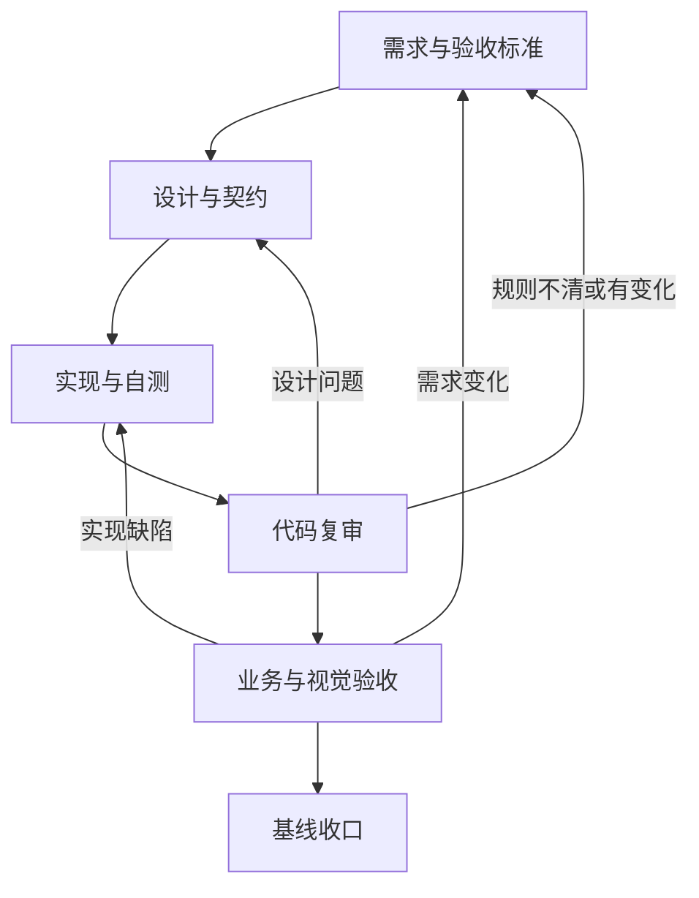

# CDC 配置管理平台 Feature 开发与调整标准流程 V2

## 1. 文档定位

### 1.1 文档用途

本文档用于在新的 ChatGPT 会话中，指导 CDC 配置管理平台开展以下工作：

- 开发一个全新的 Feature；
- 调整一个已经完成的 Feature；
- 接续一个只完成了部分阶段的 Feature；
- 修复一个已经明确的缺陷；
- 在需求变化后重新完成设计、实现、复审、验收和基线收口。

本文档是项目通用流程，不描述任何具体 Feature 的业务需求，也不与日志查询、数据源管理或其他具体功能绑定。

新会话收到本文档后，应先识别任务属于哪一种入口，再读取 Git 仓库中的现行基线和实现事实。不得仅凭聊天摘要、历史提示词或 Agent 报告直接进入代码修改。

### 1.2 适用对象

本文档涉及四类参与者：

| 参与者 | 主要职责 |
|---|---|
| 项目负责人（用户） | 决定业务目标、范围、取舍并作最终批准 |
| ChatGPT | 需求分析、文档设计、提示词生成、代码复审、验收组织和一致性判断 |
| 代码 Agent | 按批准基线实施、测试、构建、提交并报告证据 |
| Git 与运行环境 | 保存当前实现、文档、提交历史和可复核证据 |

Agent 可以实现和自测，但不能自行批准需求、设计、实现或正式验收结果。

### 1.3 核心目标

整个流程最终要保证：

```text
需求有正式依据
设计能解释需求
实现符合设计与需求
测试和验收提供证据
当前状态有基线记录
全部变更可以追溯
```

---

## 2. 一个流程、四种入口

新功能开发和已有功能调整不需要维护两套流程。它们使用同一套阶段，只是进入位置不同。

| 入口 | 典型情况 | 首要动作 | 通常进入阶段 |
|---|---|---|---|
| 新建 Feature | 项目中尚无正式功能基线 | 调查现有代码、数据和相邻功能，建立功能目录 | 阶段 1 |
| 调整已有 Feature | 已完成或已验收功能增加需求、改变行为 | 恢复现行基线和实现，判断变更影响层级 | 阶段 1、4 或 6 |
| 接续半成品 Feature | 已完成需求、设计或部分实现 | 判断每一阶段是否满足退出条件 | 第一个未完成阶段 |
| 修复明确 Bug | 预期规则不变，仅实现偏离 | 复现并确认基线已经清楚定义正确行为 | 阶段 6 |

### 2.1 入口判断规则

1. 业务目标、规则、范围或验收标准发生变化：回到需求阶段。
2. 需求不变，但接口、UI、数据模型或技术方案需要调整：回到设计阶段。
3. 需求和设计均不变，只是代码实现错误：可以进入定向实现阶段。
4. 代码已经完成但尚未复审：进入代码复审阶段。
5. 代码复审通过但未做业务或视觉确认：进入验收阶段。
6. 实现和验收均完成但文档状态未收口：进入基线收口阶段。
7. 无法证明前一阶段已经完成：不得假定完成，应从该阶段重新核对。

### 2.2 螺旋式回退

流程不是只能单向执行。任何阶段发现上游问题，都应回到对应阶段修订后重新向下推进。



回退不是失败，而是保证最终基线、实现和验收一致的正常机制。

---

## 3. 文档体系与权威边界

### 3.1 四类文档

#### A. 项目级基线

通常包括：

```text
docs/baseline/
├── PROJECT.md
├── ENVIRONMENT.md
├── ARCHITECTURE.md
├── DEVELOPMENT_RULES.md
├── PROJECT_STATUS.md
└── DOMAIN_GLOSSARY.md
```

它们描述全项目共同遵守的长期事实、环境、架构、术语和开发规则。

#### B. 项目级数据库基线

通常包括：

```text
docs/database/
├── README.md
├── SCHEMA.md
├── RELATIONS.md
├── CODE_VALUES.md
├── DATA_PROFILE.md
├── VERIFICATION.md
├── CHANGELOG.md
└── tables/
    └── <TABLE_NAME>.md
```

它们描述数据库对象、表结构、字段、注释、约束、逻辑关系、数据规模、维护方、数据特征和核验规则。

#### C. Feature 级基线

复杂 Feature 通常采用：

```text
docs/features/<feature>/
├── README.md
├── REQUIREMENTS.md
├── ACCEPTANCE.md
├── DESIGN.md
├── API.md
├── UI.md
└── DATABASE.md
```

并非每个 Feature 都必须机械创建全部文件。是否需要某份文档，由该 Feature 是否涉及相应内容决定：

| 文档 | 职责 | 适用条件 |
|---|---|---|
| `README.md` | 当前功能状态、导航和最终实现概览 | 所有正式 Feature |
| `REQUIREMENTS.md` | 业务目标、范围、规则和约束 | 所有 Feature |
| `ACCEPTANCE.md` | 可执行验收用例及证据状态 | 所有需要正式验收的 Feature |
| `DESIGN.md` | 组件、流程、状态、事务、并发和技术边界 | 非简单变更 |
| `API.md` | 请求、响应、错误码和兼容契约 | 存在前后端或外部接口 |
| `UI.md` | 页面结构、交互、状态和视觉规则 | 存在用户界面 |
| `DATABASE.md` | Feature 对数据库的使用、特殊规则和物理变更 | 读取、写入或改变数据库对象 |

#### D. 提示词与 Agent 报告

通常位于项目规定的 prompts 和 reports 目录，用于记录：

- 某次任务要求 Agent 做什么；
- Agent 实际修改了什么；
- 执行了哪些测试、构建和环境操作；
- 对应提交和推送结果；
- 已知失败、阻断和未完成事项。

它们属于过程记录和证据，不自动成为业务基线，也不自动代表已经批准。

### 3.2 事实来源优先级

恢复当前状态时，按以下顺序核对：

1. 当前已批准的项目级和 Feature 级基线；
2. Git 当前代码与配置；
3. 当前 `README.md` 中的现行状态和未完成事项；
4. 最新代码复审、验收和批准报告；
5. 历史提示词和 Agent 执行报告；
6. 聊天摘要或人的记忆。

不同来源回答不同问题：

| 来源 | 回答的问题 |
|---|---|
| `REQUIREMENTS.md` | 系统应该满足什么业务规则？ |
| `ACCEPTANCE.md` | 怎样证明规则已经满足？当前有哪些证据？ |
| `DESIGN/API/UI/DATABASE` | 准备怎样实现，并遵守什么契约？ |
| 代码与配置 | 当前系统实际上怎样运行？ |
| `README.md` | 当前已批准实现的总体状态是什么？ |
| 提示词 | 某次 Agent 被要求做什么？ |
| Agent 报告 | Agent 声称做了什么，需要怎样复核？ |

### 3.3 冲突处理

| 冲突 | 处理方式 |
|---|---|
| 新需求与现行 REQUIREMENTS 冲突 | 先确认新需求，再修订并批准 REQUIREMENTS |
| 新需求与项目级规则冲突 | 明确影响，由项目负责人决定是否修改项目基线 |
| 代码与已批准需求冲突 | 视为实现偏差，不能让代码反向覆盖需求 |
| 设计与需求冲突 | 修订设计，必要时回到需求确认 |
| README 与当前代码冲突 | 判断是 README 过期还是代码未经批准，不静默选择 |
| 报告与实际提交冲突 | 以 Git 差异和可复现证据为准，并修正报告 |
| 两份已批准基线互相冲突 | 暂停相关实现，先解决基线冲突 |

---

## 4. 数据库文档使用规则

### 4.1 先读文档，按触发条件重新核验

Feature 涉及数据库时，应先读取已经批准的项目级数据库基线，尤其是：

- `docs/database/README.md`；
- `SCHEMA.md`；
- `RELATIONS.md`；
- `CODE_VALUES.md`；
- `DATA_PROFILE.md`；
- 相关 `tables/<TABLE_NAME>.md`；
- 涉及物理调整时读取 `CHANGELOG.md` 和 `VERIFICATION.md`。

不得为了每个 Feature 机械地反复读取全部数据库元数据。

只有项目级数据库基线规定的重新核验触发条件成立，或现有证据不足以作出关键判断时，才进行相应只读核验。

### 4.2 Feature 级 DATABASE.md 的职责

Feature 级数据库文档不应完整复制项目级表结构。它主要记录：

- 本 Feature 使用哪些表和字段；
- 读取、写入、删除和事务边界；
- Feature 特有的字段解释、过滤、映射和校验；
- 如何处理空值、孤立引用、重复记录和历史脏数据；
- 本 Feature 依赖的逻辑关系和代码级完整性保护；
- 查询规模、索引依赖和性能假设；
- 是否需要 DDL、迁移、回滚或数据修复；
- 对项目级数据库基线的引用；
- 需要回写项目级数据库基线的元数据变化。

### 4.3 数据库变更边界

以下事项必须单独识别，不能作为普通代码实现顺手执行：

- DDL；
- 新增、删除或修改索引；
- 分区或子分区调整；
- 新增约束或物理外键；
- 数据清洗、回填或批量修复；
- 生产数据写入；
- 改变字段业务含义；
- 改变表维护方或写入链路。

涉及数据库写操作时，必须遵守项目级授权规则。只读权限不等于写入或 DDL 权限。

### 4.4 无物理外键时的实现要求

如果项目采用逻辑关系而没有物理外键，代码必须主动考虑：

- 引用为空；
- 被引用记录不存在；
- 类型或类别不符合预期；
- 一对一关系出现多条记录；
- 历史数据与当前规则不一致。

不得因为开发库当前没有异常数据，就假定生产环境永远完整。

---

## 5. 阶段总览与门禁

每个阶段都必须明确进入条件、必须产物、退出条件和批准人。

| 阶段 | 进入条件 | 必须产物 | 退出条件 | 批准或判断者 |
|---|---|---|---|---|
| 0. 现场与状态恢复 | 已明确目标 Feature | 当前状态说明、Git 现场、文档清单、差距清单 | 能说明已完成、未完成和冲突项 | ChatGPT 复核，用户确认关键事实 |
| 1. 需求发现 | 当前状态已基本明确 | 已确认问题、目标、范围、非范围、待确认项 | 影响产品行为的问题已确认 | 用户 |
| 2. 需求与验收基线 | 阶段 1 完成 | REQUIREMENTS、ACCEPTANCE，必要时 README 索引 | 文档完整、无矛盾、可验收 | ChatGPT 复审 |
| 3. 需求批准 | 文档已复审 | 批准元数据和批准记录 | 需求与验收标准正式 APPROVED | 用户最终批准 |
| 4. 设计与契约 | 需求已批准 | DESIGN、API、UI、DATABASE 中适用文件 | 设计覆盖所有批准需求 | ChatGPT 复审 |
| 5. 设计批准 | 设计已复审 | 批准元数据和批准记录 | 实现边界、接口、UI、数据方案已批准 | 用户最终批准 |
| 6. 实现任务准备 | 需求与适用设计已批准 | Agent 提示词 | 范围、权限、测试、Git 规则明确 | ChatGPT |
| 7. Agent 实现与自测 | 提示词已确认 | 代码、测试、构建结果、Agent 报告、提交 | Agent 在授权范围内完成并停止 | Agent 执行，不能自批 |
| 8. ChatGPT 代码复审 | 存在可复核提交 | REVIEW_PASS 或 CHANGES_REQUIRED | 无未解决代码复审问题 | ChatGPT |
| 9. 开发阶段验收 | 代码复审通过 | 验收证据、状态更新、页面地址或接口证据 | 可执行用例已执行，阻断真实记录 | ChatGPT 组织，用户确认业务/视觉 |
| 10. 实现批准与基线收口 | 验收达到批准条件 | README、状态、收口报告 | 当前需求、实现和文档一致 | 用户最终批准 |
| 11. 项目基线影响处理 | Feature 变化已稳定 | 必要的项目级基线修订 | 全局事实同步或确认不受影响 | 用户批准项目级变化 |
| 12. 最终一致性检查 | 前述阶段完成 | 最终检查结果 | Git、文档、状态、证据均可复核 | ChatGPT |

阶段编号用于描述顺序，不要求一个 Agent 一次执行全部阶段。

---

## 6. 阶段 0：建立现场并恢复真实状态

### 6.1 目标

在讨论或修改前，先知道项目现在是什么状态，避免基于旧记忆或历史报告工作。

### 6.2 必须检查

- 项目根规则文件；
- 项目级基线；
- 项目级数据库基线（如相关）；
- 目标 Feature 的全部现行基线；
- 目标 Feature 的最新提示词、报告和批准记录；
- 前后端代码、路由、菜单、配置和测试；
- Git 分支、HEAD、远程同步情况；
- 暂存区、已修改文件和未跟踪文件；
- 运行中的服务和临时配置（仅在任务相关且授权时检查）。

### 6.3 工作区保护

现有工作区内容默认属于用户。必须：

- 在任务开始前记录 Git 现场；
- 区分任务改动与既有改动；
- 不覆盖、不删除、不擅自暂存既有修改；
- 不用破坏性命令恢复工作区；
- 提交时精确暂存任务文件；
- 必要时用干净临时 worktree 验证提交本身可独立构建。

### 6.4 输出

形成简短、可核对的状态说明：

- 当前已批准到哪个阶段；
- 当前代码已经实现什么；
- 哪些内容仍在审查、验收或延期；
- 本次目标可能影响哪些文档和代码；
- 是否有冲突、阻断或需要用户确认的事实。

此阶段只恢复事实，不擅自批准历史任务，也不直接生成实现提示词。

---

## 7. 阶段 1：需求发现与业务确认

### 7.1 目标

明确用户真正需要的业务结果，而不是直接讨论代码怎样改。

### 7.2 通用确认范围

根据 Feature 性质选择适用问题：

- 功能入口、菜单、路由和使用角色；
- 查询、新增、修改、删除、启停等操作；
- 页面布局、字段、文案和交互；
- 默认值、必填项、校验和唯一性；
- 数据来源、关联、过滤、排序和分页；
- 接口参数、响应字段和错误行为；
- 空数据、加载中、失败、超时和部分成功；
- 删除方式、引用影响和恢复能力；
- 密码、密钥和敏感字段处理；
- 事务、并发、幂等和失败回滚；
- 历史数据、脏数据和向后兼容；
- 数据规模、性能目标和超时边界；
- 权限、审计和外部系统边界；
- 用户怎样判断功能已经完成。

### 7.3 提问原则

- 只向用户询问会改变产品行为、风险或范围的问题；
- 将相关问题分组，避免逐个零散追问；
- 提供推荐方案及理由，但由用户决定业务取舍；
- 纯技术实现优先遵循现有架构和项目规则；
- 未确认事项必须显式记录，不得伪装成默认事实。

### 7.4 退出条件

- 功能目标清楚；
- 范围和非范围清楚；
- 关键业务规则无冲突；
- 重大风险和待决定事项已向用户说明；
- 已经能够编写可执行验收标准。

---

## 8. 阶段 2：建立 REQUIREMENTS 与 ACCEPTANCE

### 8.1 REQUIREMENTS.md

至少应记录：

- 背景和目标；
- 用户角色和使用场景；
- 功能范围与非范围；
- 业务规则；
- 页面与交互要求；
- 数据、接口和安全边界；
- 异常、超时和兼容规则；
- 性能和规模假设；
- 待决定事项及其阻断范围；
- 被替代或废止的旧规则；
- 文档和实现状态。

### 8.2 ACCEPTANCE.md

验收文档应与需求同时建立，而不是实现完成后临时补写。每个用例至少应具备：

- 唯一编号；
- 对应需求；
- 前置条件；
- 操作步骤或验证方法；
- 预期结果；
- 当前执行状态；
- 证据或阻断原因。

验收用例必须覆盖：

- 正常路径；
- 输入边界；
- 空值与异常数据；
- 失败、超时和重试边界；
- 并发、事务或幂等（如适用）；
- UI 加载、空数据、失败和成功状态；
- 向后兼容；
- 性能和物理设计延期项（如适用）。

### 8.3 验收状态语义

推荐使用项目已经采用的状态：

| 状态 | 含义 |
|---|---|
| `NOT_RUN` | 尚未执行，不能推定通过 |
| `PASS` | 已有与步骤匹配的客观证据 |
| `FAIL` | 已执行且结果不符合预期 |
| `BLOCKED` | 当前环境或前置条件阻止执行 |
| `DEFERRED_UNTIL_*` | 经批准延期到明确的后续阶段 |

不得因为单元测试通过，就将所有人工视觉或真实环境用例批量标记为 PASS。

### 8.4 新 Feature 的 README

新 Feature 可以在此阶段建立 `README.md` 作为文档索引和状态入口，但必须明确：

- 当前仍处于需求或设计阶段；
- 尚未实现的内容不能写成当前事实；
- README 最终实现部分要在验收收口时更新。

---

## 9. 阶段 3：需求基线复审与批准

### 9.1 ChatGPT 复审

重点检查：

- 是否准确反映用户确认；
- 是否混入未经确认的推断；
- 需求之间是否冲突；
- 当前实现和目标需求是否混淆；
- 验收用例能否实际执行；
- 是否遗漏失败路径和数据边界；
- 是否错误扩大 Feature 范围；
- 是否影响项目级或数据库基线。

### 9.2 用户批准

只有项目负责人明确批准后，需求和验收基线才能进入 `APPROVED`。

批准记录至少包括：

- 批准状态；
- 批准任务编号；
- 批准日期；
- 批准基线提交；
- 仍然延期或待决定的事项；
- 批准不代表已经实现或验收通过的声明。

未经批准，不进入完整设计或实现阶段。探索性原型必须另行明确边界。

---

## 10. 阶段 4：DESIGN、API、UI 与 DATABASE 设计

### 10.1 DESIGN.md

根据复杂度描述：

- 组件和职责边界；
- 请求、处理和数据流；
- 状态机或页面状态；
- 事务、并发、幂等和回滚；
- 缓存、定时任务或异步处理；
- 安全和权限；
- 兼容方案；
- 性能策略；
- 日志、监控和可诊断性；
- 已接受的限制和延期设计。

### 10.2 API.md

至少描述：

- 路径和方法；
- 请求参数、类型、必填和校验；
- 响应结构和字段语义；
- 数值、日期、ID 等序列化规则；
- 错误码和 HTTP 状态；
- 超时、幂等和兼容行为；
- 接口与验收用例映射。

### 10.3 UI.md

至少描述：

- 页面入口、布局和组件；
- 表单、列表、分页、弹窗；
- 默认值和首次进入行为；
- 加载、初始化、空数据、失败、超时和成功状态；
- 禁用、取消、重试和防重复提交；
- Tab 或路由切换后的状态保留；
- 文案、Tooltip 和异常数据降级；
- 人工视觉验收要点。

### 10.4 DATABASE.md

按照第 4 章记录 Feature 特有的数据使用和变更边界。若不需要 DDL，应明确写明“不需要 DDL”，防止实现任务顺手改变物理结构。

### 10.5 设计的可追溯性

设计文件应能回答每条关键需求怎样实现。若设计改变了业务语义，应先回到需求阶段，而不是在设计文档中悄悄改变规则。

---

## 11. 阶段 5：设计复审与批准

设计复审重点包括：

- DESIGN、API、UI、DATABASE 是否互相一致；
- 是否覆盖全部已批准需求；
- 前后端字段、状态和错误契约是否一致；
- 数据库关系、事务和异常数据处理是否明确；
- 是否存在隐含 DDL 或生产变更；
- 性能方案是否匹配数据规模；
- 测试和验收是否能够证明设计成立；
- 待决定事项是否被错误当作已决定。

用户批准设计后，才能生成完整实现提示词。

批准设计不代表：

- 代码已经实现；
- 实现已经复审；
- 验收已经执行；
- 生产开关可以启用；
- 延期的物理设计已经批准。

---

## 12. 阶段 6：生成 Agent 实现提示词

### 12.1 提示词定位

提示词是一次具体执行任务，不是业务基线。它必须引用已批准文档，不得重新发明需求。

### 12.2 必须包含

1. 任务编号、目标和授权基线提交；
2. 开始前必须读取的项目及 Feature 文档；
3. 当前实现和目标差距；
4. 允许修改的文件或模块；
5. 禁止修改的范围；
6. 前端、后端、数据库和配置要求；
7. 外部系统读写权限；
8. 测试、构建和真实环境验证要求；
9. 用户工作区保护规则；
10. 提交、推送及禁止 force push 的规则；
11. 干净提交验证要求；
12. 报告和结构化结果格式；
13. 完成后必须停止的边界；
14. 实现状态只能达到哪个阶段。

### 12.3 任务拆分

小型、低风险修改可以一次完成。复杂任务可以拆为：

- 基线建立或调整；
- 数据库物理设计；
- 后端实现；
- 前端实现；
- 联调和自动化测试；
- 开发阶段验收；
- 实现批准和基线收口。

任务拆分应以可独立复审为原则，不必为了形式把强耦合的前后端改动强行拆开。

---

## 13. 阶段 7：Agent 实现、自测与报告

### 13.1 Agent 职责

- 读取任务要求和批准基线；
- 检查 Git 现场；
- 只修改授权范围；
- 实现代码并增加有效测试；
- 执行规定的构建和测试；
- 在授权时进行只读联调或启动服务；
- 用提交内容建立可复核证据；
- 如实报告失败、阻断和环境差异；
- 精确提交并按授权推送；
- 推送成功后停止。

### 13.2 禁止行为

- 自行改变已批准业务规则；
- 把测试适配到错误实现来制造通过；
- 把未执行用例标记为 PASS；
- 未经授权执行数据库写入、DDL 或生产启用；
- 顺手重构无关模块；
- 覆盖用户既有工作区；
- 通过 Agent 自己的报告宣布实现正式批准。

### 13.3 需求变化处理

实现中如果发现必须改变已批准需求：

```text
停止相关实现
→ 说明原因、证据和影响
→ 用户确认新规则
→ 修订并批准受影响基线
→ 更新设计
→ 重新生成实现任务
```

### 13.4 Agent 报告

报告至少包含：

- 基线和结果提交；
- 实际修改文件；
- 逐项实现说明；
- 测试和构建结果；
- 干净提交验证结果；
- 已知失败及是否可在基线复现；
- 数据库、ZooKeeper、DDL 和生产开关操作情况；
- 工作区保护情况；
- 推送和 ahead/behind；
- 当前实现、复审和验收状态；
- 下一步边界。

报告是待复核声明，不是复审结论。

---

## 14. 阶段 8：ChatGPT 代码复审与定向修订

### 14.1 复审原则

不能只阅读 Agent 报告。应检查实际提交、关键调用链和测试断言。

重点核对：

- 提交范围是否准确；
- 需求和设计是否真实落地；
- UI 组件的真实事件顺序；
- 异步请求、迟到响应和页面代次；
- 空值、重复、孤立引用和异常数据；
- 事务、并发、幂等和回滚；
- 超时、取消、重试和错误映射；
- 分页、游标、排序和边界；
- 前后端契约与类型安全；
- 测试是否绕开了真实组件或调用链；
- 干净环境是否能够复现测试与构建；
- 是否夹带无关变更。

### 14.2 复审结论

建议使用：

| 结论 | 含义 |
|---|---|
| `REVIEW_PASS` | 未发现需要修订的问题，可以进入验收 |
| `CHANGES_REQUIRED` | 存在明确问题，需要定向修订 |
| `BLOCKED` | 缺少环境、权限、证据或上游决定 |

### 14.3 修订任务

发现问题时，应生成范围尽可能小的修订提示词：

- 明确复现过程；
- 明确期望行为；
- 指定必须增加的真实测试；
- 保持已经正确的实现；
- 不扩大为重新设计；
- 修订后仍保持 `IMPLEMENTED_PENDING_REVIEW`；
- 重新经过代码复审。

---

## 15. 阶段 9：开发阶段验收与用户确认

### 15.1 验收层次

| 验收类型 | 主要证据 |
|---|---|
| 自动化验收 | 单元、组件、接口和集成测试 |
| 构建验收 | 前后端干净构建 |
| 开发环境联调 | 真实接口、只读数据库或外部系统证据 |
| 人工视觉验收 | 页面截图、地址和用户实际操作 |
| 业务验收 | 用户确认业务结果符合预期 |
| 性能与物理验收 | 生产等价数据规模、索引和部署环境 |

不同证据不能互相替代。例如，组件测试不能替代用户对视觉效果的确认，开发库小数据查询不能替代生产等价性能验收。

### 15.2 验收执行规则

- 逐项执行 `ACCEPTANCE.md`；
- 只按实际证据更新状态；
- `BLOCKED` 必须记录具体阻断；
- 延期项必须有明确延期阶段和启用边界；
- 环境特征与代码缺陷要区分；
- 发现缺陷时回到实现阶段；
- 用户提出新需求时回到需求阶段；
- 验收任务不得顺手修复业务代码，除非另行授权。

### 15.3 页面验收常见检查

- 菜单、路由和首次进入；
- 布局、尺寸、文案和可读性；
- 默认值、查询、重置、排序和分页；
- 初始化、加载、长耗时、空数据、失败和超时；
- 按钮禁用、防重复提交、取消和重试；
- Tab 或路由切换后的状态保留；
- 弹窗、Tooltip、长文本和敏感信息；
- 异常数据的降级展示；
- 用户主动操作是否会被后台初始化或迟到响应覆盖。

---

## 16. 阶段 10：实现批准与 Feature 基线收口

### 16.1 README 回写

只有代码复审和要求的验收完成后，才把 README 回写为当前实现事实。至少更新：

- 功能定位；
- 当前实现状态；
- 页面、菜单和路由；
- 当前接口；
- 当前数据来源和数据库对象；
- 当前业务口径；
- 当前事务、并发和失败行为；
- 当前 UI 状态和交互；
- 当前测试与验收情况；
- 已知限制和延期项；
- 关键实现入口；
- 最后验收提交和日期；
- 相关文档导航。

### 16.2 同步其他 Feature 文档

收口前必须确认：

- REQUIREMENTS 是最终批准规则；
- ACCEPTANCE 状态与证据一致；
- DESIGN/API/UI/DATABASE 与最终批准实现一致；
- 历史状态明确保留为历史，不与当前状态混淆；
- 报告中的旧结论没有被当作现行状态；
- 未实施或延期内容仍然清楚标记。

### 16.3 实现批准

实现只有在项目负责人明确批准后，才能从类似：

```text
IMPLEMENTED_PENDING_REVIEW
```

收口为项目实际采用的已接受状态，例如：

```text
IMPLEMENTED_ACCEPTED
```

实现批准不自动代表生产启用。生产启用可以有独立的物理设计、性能、部署和运维门禁。

---

## 17. 阶段 11：项目级基线影响评估

普通 Feature 内部调整通常不修改全部项目基线。只有事实影响全项目时才同步：

| 变化 | 可能更新的项目文档 |
|---|---|
| 项目目标或模块范围 | `PROJECT.md` |
| JDK、Node、数据库、端口或部署环境 | `ENVIRONMENT.md` |
| 公共架构、模块边界或数据流 | `ARCHITECTURE.md` |
| Git、测试、数据库操作和 Agent 规则 | `DEVELOPMENT_RULES.md` |
| 项目里程碑和总体进度 | `PROJECT_STATUS.md` |
| 全局术语或统一口径 | `DOMAIN_GLOSSARY.md` |
| 表结构、字段、关系、码值或数据特征 | `docs/database/` 对应文档 |

判断问题：

```text
这次变化只是某个 Feature 如何使用现有能力，
还是改变了整个项目共同依赖的事实？
```

前者通常只更新 Feature 基线；后者需要项目负责人批准项目级基线变更。

---

## 18. 阶段 12：最终一致性检查

任务关闭前必须满足：

```text
批准需求 = 最终业务规则
批准设计 = 最终实现方案和契约
代码配置 = 实际实现
测试验收 = 可复核证据
README   = 当前批准状态
项目基线 = 仍然有效或已同步
```

### 18.1 最终检查表

- [ ] 已识别正确的流程入口；
- [ ] 开始前已恢复 Git 和功能现场；
- [ ] 用户工作区既有内容得到保护；
- [ ] 需求、范围、非范围和异常边界已确认；
- [ ] REQUIREMENTS 与 ACCEPTANCE 已批准；
- [ ] 适用的 DESIGN、API、UI、DATABASE 已批准；
- [ ] Agent 实现范围和权限明确；
- [ ] 实际提交已经由 ChatGPT 复审；
- [ ] 复审问题已定向修复并重新复审；
- [ ] 自动化测试和构建有干净提交证据；
- [ ] 人工视觉和业务确认已按需要执行；
- [ ] 未执行、阻断和延期用例没有被伪造为 PASS；
- [ ] README 与其他 Feature 文档已经收口；
- [ ] 项目级和数据库基线影响已评估；
- [ ] 数据库、ZooKeeper、DDL 和生产开关操作符合授权；
- [ ] Git 提交与推送范围准确；
- [ ] 当前状态、批准记录和历史记录边界清楚；
- [ ] 最终报告可以由第三方复核。

未完成闭环时，可以结束某个执行任务，但不能把整个 Feature 宣布为正式完成。

---

## 19. 状态模型建议

具体字段以项目现行文档为准，不为统一格式而破坏已批准基线。常见状态可以这样理解：

### 19.1 基线状态

| 状态 | 含义 |
|---|---|
| `DRAFT_PENDING_USER_REVIEW` | 草案等待用户审阅 |
| `APPROVED` | 当前范围已经正式批准 |
| `HISTORICAL_SUPERSEDED` | 历史文档，已被后续基线替代 |

### 19.2 实现状态

| 状态 | 含义 |
|---|---|
| `NOT_STARTED` | 尚未实现 |
| `IN_PROGRESS` | 正在实现或有未完成调整 |
| `IMPLEMENTED_PENDING_REVIEW` | 已实现并自测，等待代码复审或验收 |
| `IMPLEMENTED_ACCEPTED` | 实现已经复审、验收并获批准 |

### 19.3 验收状态

Feature 总体验收状态和单个用例状态应分开。执行了部分用例，不等于整个 Feature 已通过验收。

状态必须描述事实，不能作为鼓励 Agent 完成工作的装饰性标签。

---

## 20. 提示词与报告管理规则

### 20.1 提示词

- 超过短消息长度时保存为 Markdown 文件；
- 标明任务编号、基线提交和授权范围；
- 引用批准文档，不重复制造另一套业务规则；
- 修订提示词使用连续编号；
- 历史提示词保留时必须能识别已被替代关系。

### 20.2 报告

- 报告记录执行证据和状态；
- 当前状态以最新批准基线和实际 Git 为准；
- Agent 报告不能自行把状态改为已批准；
- 报告中的失败、阻断和未运行项必须如实保留；
- 报告可以引用提示词路径，但提示词不因此成为业务基线；
- 不应在报告中扩散密钥、密码、原始业务数据或敏感日志正文。

### 20.3 历史记录

- 历史记录保持当时事实，不批量改写成当前状态；
- 当前状态段和历史变更记录必须容易区分；
- 微型措辞修正不能冒充新的业务批准；
- 后续批准任务不能抹去曾经存在的失败或延期证据。

---

## 21. 新会话启动模板

### 21.1 开发全新 Feature

```text
请先完整读取《CDC 配置管理平台 Feature 开发与调整标准流程 V2》，
并按照其中“新建 Feature”入口开展工作。

本次准备开发的新功能是：【Feature 名称】。
初步目标：【目标说明】。

请先只读检查项目级基线、项目级数据库基线、相邻功能和现有代码，
恢复当前状态并与我讨论需求。有需要我决定的业务问题请集中提出。
在 REQUIREMENTS 和 ACCEPTANCE 获得批准前，不要生成代码实现提示词。
```

### 21.2 调整已有 Feature

```text
请先完整读取《CDC 配置管理平台 Feature 开发与调整标准流程 V2》，
并按照其中“调整已有 Feature”入口开展工作。

目标功能：【Feature 名称】。
当前问题：【问题说明】。
希望调整为：【目标效果】。

请先读取该功能的全部现行基线、最新复审和验收报告以及当前代码，
判断本次变更需要回到需求、设计还是实现阶段。
有需要我决定的问题先询问，不要直接修改代码。
```

### 21.3 接续半成品 Feature

```text
请按照《CDC 配置管理平台 Feature 开发与调整标准流程 V2》，
恢复【Feature 名称】的当前状态。

请根据现行基线、Git 代码、最新报告和验收状态，列出：
1. 已批准并完成的阶段；
2. 已实现但尚未复审或验收的内容；
3. 未完成、阻断和延期事项；
4. 应从哪个阶段继续以及理由。

在状态恢复完成前，不要生成新的实现提示词。
```

### 21.4 修复明确 Bug

```text
请按照《CDC 配置管理平台 Feature 开发与调整标准流程 V2》处理
【Feature 名称】中的以下问题：【复现过程和错误表现】。

请先核对现行 REQUIREMENTS、DESIGN、API、UI、DATABASE 和 ACCEPTANCE，
判断这是实现偏差还是需求变化。
如果只是实现偏差，给出定向修订方案；如果会改变业务规则，先回到需求阶段。
不要未经确认扩大修改范围。
```

---

## 22. 通用 Agent 提示词骨架

```markdown
# <TASK-CODE>

## 1. 任务目标与状态边界

## 2. 授权基线与 Git 现场

## 3. 开始前必须读取
- 项目规则
- 项目级基线
- 项目级数据库基线（如适用）
- Feature 全部现行基线
- 相关代码与测试

## 4. 已批准需求与设计依据

## 5. 当前实现与待修差距

## 6. 允许修改范围

## 7. 禁止修改范围

## 8. 实现要求

## 9. 自动化测试、构建与联调

## 10. 数据库、ZooKeeper、DDL 和生产开关权限

## 11. 用户工作区保护

## 12. 干净提交验证

## 13. Commit、Push 与停止条件

## 14. 最终报告

## 15. AGENT_TASK_RESULT 结构化结果块
```

提示词必须清楚说明：

- 哪些文档是已批准依据；
- Agent 可以达到的最高状态；
- 哪些操作需要额外授权；
- 任务结束后下一步只允许做什么。

---

## 23. 使用本流程时的简化原则

流程严谨不等于每次都必须产生大量文档和任务。

### 23.1 可以简化的情况

对于不改变业务行为的小修复：

- 核对现行基线已明确正确行为；
- 记录复现和根因；
- 生成微型定向实现任务；
- 增加回归测试；
- 代码复审并验收；
- 必要时更新 README 或报告。

无需重新批准完全未受影响的需求和设计文件。

### 23.2 不能简化的情况

以下情况不能绕过上游阶段：

- 改变用户可见行为；
- 改变字段含义或数据口径；
- 新增或改变接口契约；
- 改变写入、删除、事务或安全边界；
- 执行 DDL 或数据修复；
- 改变生产启用条件；
- 现有基线互相冲突；
- 无法判断现有实现是否已经获批。

### 23.3 最小充分产物

每次只产生完成闭环所需的最小充分文档，但任何关键业务决定都不能只停留在聊天或 Agent 报告中。

---

## 24. 最终原则

这套流程的重点不是增加文档数量，而是让每个阶段都可以回答清楚：

1. 现在依据什么开始？
2. 这一阶段必须产出什么？
3. 怎样证明这一阶段已经完成？
4. 谁有权批准进入下一阶段？
5. 如果发现问题，应回到哪一层修订？

无论是新建 Feature、调整已有功能、接续半成品还是修复 Bug，都遵循同一原则：

```text
先恢复事实
再确认目标
用文档固定规则
用设计消除歧义
用实现兑现目标
用复审发现偏差
用验收证明结果
用基线记录现状
```

